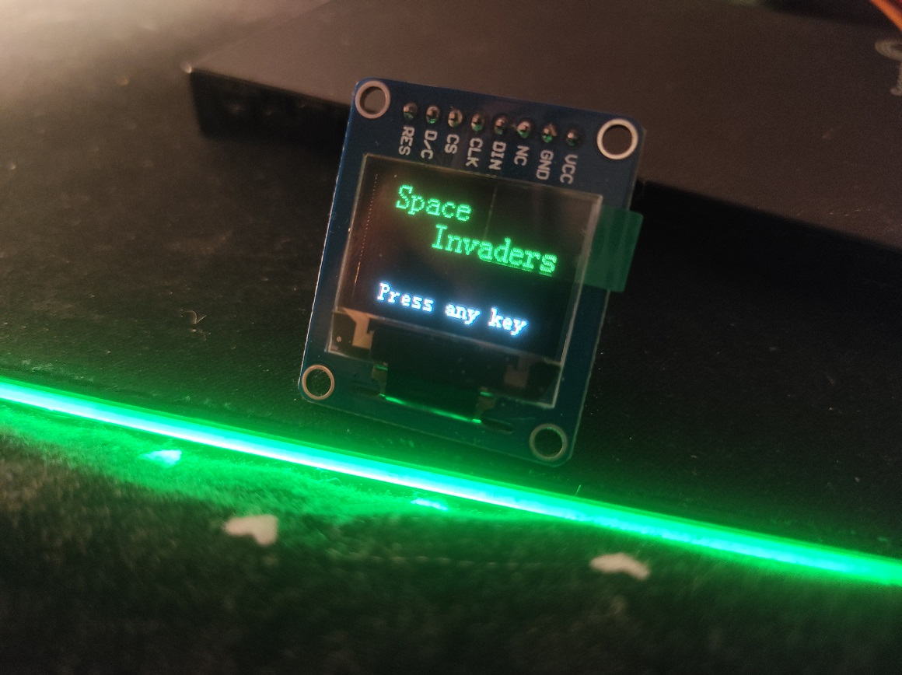

Space Invaders
==============

Implementation of ["Space Invaders"](https://en.wikipedia.org/wiki/Space_Invaders)
for the FRDM-KL05Z board with [WSR-04432 display](https://www.waveshare.com/wiki/0.95inch_RGB_OLED_(B)).

## Hardware

The hardware used for this project is:
 - FRDM-KL05Z
 - [WSR-04432](https://www.waveshare.com/wiki/0.95inch_RGB_OLED_(B)) OLED display used for video output
 - UART terminal

### Microcontroller characteristics

**KL05Z** (MKL05Z32VFM4 MCU) has following specifications:
 - 48 MHz
 - 32 kB flash
 - 4 kB SRAM
 - 32QFN

### Display pins

KL05Z board | Display | Comment
------------|---------|---------------------------------------------------------------
PTA5        | CS      | `Slave Select` - should be enabled when talking to this device
PTB0        | CLK     | `Clock` - clock signal emitted by master device (MCU)
PTA7        | DIN     | `Data` - master out slave in data pin
PTB7        | D/C     | `Data/Command Select` - set communication mode
PTB6        | RES     | `Reset`
